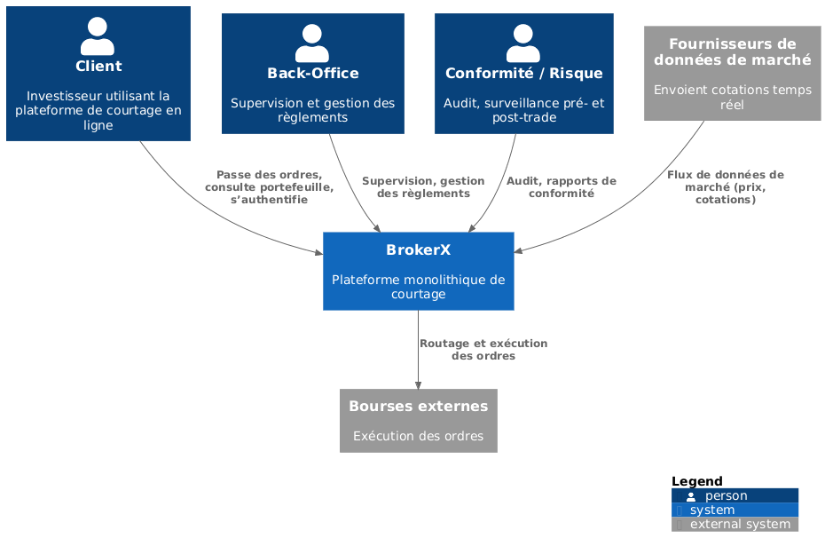
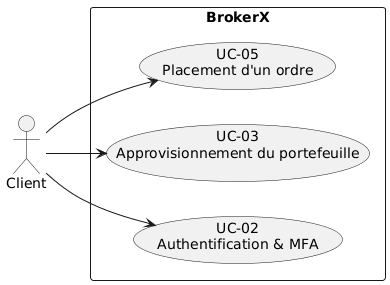

# BrokerX – Documentation d’Architecture
Ce document, basé sur le modèle **arc42**, décrit l’architecture du système BrokerX.

---

## 1. Introduction et Objectifs

### Panorama des exigences
L’application « BrokerX » est un prototype Java monolithique de courtage sécurisé permettant à ses clients de:
- Passer des ordres 
- Consulter leurs portefeuilles 
- Recevoir exécutions et confirmations
- Effectuer le règlement et la compensation des transactions 

Elle comprend :  
- L’utilisation de conteneurs avec Docker  
- L’écriture et l’exécution de tests automatisés avec JUnit + Maven  
- La combinaison d’outils modernes de développement (VS Code, Git, Docker)  

L’objectif de cette première phase est de fournir un prototype monolithique fonctionnel, conteneurisé avec Docker, incluant des tests automatisés et un pipeline CI/CD de base.  
Les phases futures évolueront vers des microservices puis une architecture orientée événements.

### Objectifs qualité
| Priorité | Objectif qualité | Scénario |
|----------|------------------|----------|
| 1 | **Performance** | Latence de placement d’ordre ≤ 500 ms, débit ≥ 300 ordres/sec |
| 2 | **Sécurité** | MFA pour l’authentification, validation des entrées |
| 3 | **Disponibilité** | Est disponible 90.0% du temps |
| 4 | **Déployabilité** | Pipeline CI/CD automatisé avec GitLab |

### Parties prenantes
- **Clients** : Investisseurs utilisant la plateforme 
-**Opérations Back-Office** : gestion des règlements, supervision. 
-**Conformité / Risque** : surveillance pré- et post-trade. 
-**Fournisseurs de données de marché** : cotations en temps réel. 
-**Bourses externes** : simulateurs de marché pour routage d’ordres.  
- **Développeurs** : Apprentissage des outils modernes de développement et des pipelines CI/CD  

---

## 2. Contraintes d’architecture
| Contrainte | Description |
|------------|-------------|
| **Technologie** | Java 21 avec Spring Boot, PostgreSQL, JUnit et GitLab CI/CD |
| **Déploiement** | Application et base de données conteneurisées avec Docker et orchestrées avec docker-compose |
| **Éducatif** | Le projet doit démontrer clairement les concepts d’infrastructure et de CI/CD |

---

## 3. Portée et contexte du système

Must haves:

## UC-02 — Authentification & MFA

**Objectif :**  
Permettre aux clients de se connecter à la plateforme BrokerX de manière sécurisée par une authentification multi-facteurs (MFA).

**Acteur principal :** Client  
**Déclencheur :** Le client initie une connexion à la plateforme.  
**Préconditions :** Le compte doit être actif 
**Postconditions (succès) :** Une session est créée et associée au client (token JWT signé).  
**Postconditions (échec) :** La session n’est pas créée, un message d’erreur est retourné.

**Flux principal :**
1. Le client saisit son identifiant et son mot de passe.  
2. Le système vérifie les informations  
3. Si le MFA est requis, le système demande une validation OTP 
4. Le client saisit l’OTP.  
5. Le système valide les informations, génère un token de session et enregistre les informations d’audit (IP, device, résultat).  

**Flux alternatifs / Exceptions :**
- A1 : **Appareil de confiance** → le MFA est demandé uniquement pour des opérations sensibles.  
- E1 : **MFA échoue (3 tentatives)** → le compte est temporairement verrouillé.  
- E2 : **Compte suspendu** → accès refusé, message de contact au support.

- **UC-03 — Approvisionnement du portefeuille (dépôt virtuel)**
**Objectif :**  
Donner aux utilisateurs la possibilité de créditer leur portefeuille virtuel en effectuant des dépôts simulés, afin de disposer de liquidités nécessaires pour placer des ordres d’achat. 

**Acteur principal :** Client  
**Secondaire :** Service Paiement Simulé / Back-Office 
**Déclencheur :** Le Client crédite son solde en monnaie fiduciaire simulée.   
**Préconditions :** Le compte doit être actif 
**Postconditions (succès) :** Solde augmenté, écriture comptable ajoutée (journal immuable).  
**Postconditions (échec) :** Solde inchangé. 

**Flux principal :**
1. Le client saisit le montant 
2. Le système valide 
3. Le système crée une nouvelle transaction de statut "pending"(en cours)
4. Le service de paiement simulé répond changeant le statut à "Settled"(complet)
5. Le système crédite le portefeuille du client.
6.Le système envoie un notification de complétion 

**Flux alternatifs / Exceptions :**
- A1. Paiement async : passe Pending, solde crédite à confirmation. 
- E1. Paiement rejeté : état Failed, notification avec motif. - E2. Idempotence : si retry reçu avec même idempotency-key, renvoyer le résultat précédent. 

- **UC-05 — Placement d’un ordre (marché/limite) avec contrôles pré-trade**

**Objectif :**  
Permettre au client de passer un ordre d’achat ou de vente (au marché ou à cours limité) afin de gérer son portefeuille. L’ordre est validé par le système, enregistré, et une confirmation est fournie au client.  

**Acteur principal :**  
Client 

**Déclencheur :**  
Le client initie une opération d’achat ou de vente depuis l’interface.  

**Préconditions :**  
- Le client est authentifié (UC-02 réussi).  
- Le portefeuille est approvisionné et actif (UC-03 réussi).  

**Postconditions (succès) :**  
- L’ordre est validé, enregistré, et marqué comme *en attente d’exécution*.  
- Le client reçoit une confirmation avec un identifiant d’ordre.  

**Postconditions (échec) :**  
- Aucun ordre n’est créé, un message d’erreur est affiché.  

---

### Flux principal

1. Le client sélectionne *nouvel ordre* et saisit les paramètres : type (achat/vente), titre, quantité, prix (marché ou limite).  
2. Le système valide les données saisies (titre reconnu, quantité > 0).  
3. Le système vérifie la disponibilité (fonds suffisants pour un achat, titres disponibles pour une vente).  
4. Le système enregistre l’ordre dans la base (statut : *en attente*).  
5. Le système renvoie une confirmation au client avec un identifiant d’ordre unique et les détails.  

---

### Flux alternatifs / Exceptions

- **A1 : Ordre à cours limité non exécuté immédiatement**  
  - L’ordre reste dans le carnet jusqu’à ce que le prix limite soit atteint (future phase : intégration avec bourse simulée).  

- **E1 : Fonds insuffisants**  
  - L’ordre est rejeté, message d’erreur au client.  

- **E2 : Titre inconnu ou invalide**  
  - L’ordre est rejeté, le système invite le client à corriger.  

- **E3 : Portefeuille suspendu ou inactif**  
  - L’ordre est refusé, notification envoyée au client.  

****

### Contexte technique
- **Application** : Monolithe Java 21 avec Spring Boot.
- **Tests** : JUnit 5, Spring Boot Test
- **Conteneurisation** :Docker (application + base de données).
- **CI/CD** :  Pipeline GitLab pour tests et déploiement automatique

---

## 4. Stratégie de solution
| Problème | Approche de solution |
|----------|----------------------|
|          |                      |

---

## 5. Vue des blocs de construction
*(Montrer les principaux composants/modules et leurs relations. Ajouter un diagramme UML de classes ou de packages si nécessaire.)*  

---

## 6. Vue d’exécution

---

## 7. Vue de déploiement
*(Décrire le déploiement physique du système : serveurs, conteneurs, réseaux. Ajouter un diagramme UML de déploiement si disponible.)*  

---

## 8. Concepts transversaux
*(Lister les préoccupations transverses telles que la journalisation, la sécurité, la configuration, la gestion des erreurs, etc.)*  

---

## 9. Décisions d’architecture
*(Lister les ADR – Architectural Decision Records – pour ce projet. Inclure des références aux fichiers ADR si disponibles.)*  

---

## 10. Exigences qualité

### Scénarios de qualité
- *(Lister des scénarios pour la testabilité, la performance, la disponibilité, la sécurité, etc.)*  

---

## 11. Risques et dettes techniques
*(Identifier les risques et dettes techniques connus de l’architecture actuelle.)*  

---

## 12. Glossaire
| Terme | Définition |
|-------|------------|
|       |            |
